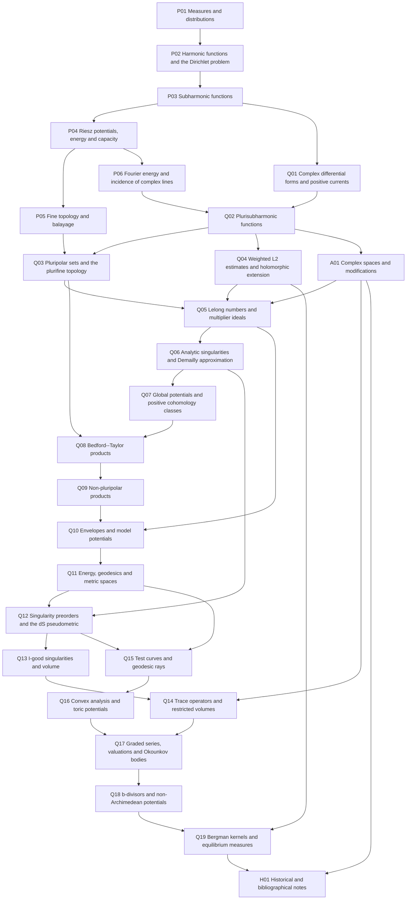

# Mathematical dependency graph

Generated from the stable chapter IDs. An appendix may be consulted when its interface is first needed; its printed placement is not a proof dependency.

```mermaid
flowchart TD
  P01["P01 Measures and distributions"]
  P02["P02 Harmonic functions and the Dirichlet problem"]
  P01 --> P02
  P03["P03 Subharmonic functions"]
  P02 --> P03
  P04["P04 Riesz potentials, energy and capacity"]
  P03 --> P04
  P05["P05 Fine topology and balayage"]
  P04 --> P05
  P06["P06 Fourier energy and incidence of complex lines"]
  P04 --> P06
  Q01["Q01 Complex differential forms and positive currents"]
  P03 --> Q01
  Q02["Q02 Plurisubharmonic functions"]
  P06 --> Q02
  Q01 --> Q02
  Q03["Q03 Pluripolar sets and the plurifine topology"]
  Q02 --> Q03
  P05 --> Q03
  Q04["Q04 Weighted L2 estimates and holomorphic extension"]
  Q02 --> Q04
  Q05["Q05 Lelong numbers and multiplier ideals"]
  Q04 --> Q05
  Q03 --> Q05
  A01 --> Q05
  Q06["Q06 Analytic singularities and Demailly approximation"]
  Q05 --> Q06
  Q07["Q07 Global potentials and positive cohomology classes"]
  Q06 --> Q07
  Q08["Q08 Bedford--Taylor products"]
  Q03 --> Q08
  Q07 --> Q08
  Q09["Q09 Non-pluripolar products"]
  Q08 --> Q09
  Q10["Q10 Envelopes and model potentials"]
  Q09 --> Q10
  Q05 --> Q10
  Q11["Q11 Energy, geodesics and metric spaces"]
  Q10 --> Q11
  Q12["Q12 Singularity preorders and the dS pseudometric"]
  Q11 --> Q12
  Q06 --> Q12
  Q13["Q13 I-good singularities and volume"]
  Q12 --> Q13
  Q14["Q14 Trace operators and restricted volumes"]
  Q13 --> Q14
  A01 --> Q14
  Q15["Q15 Test curves and geodesic rays"]
  Q11 --> Q15
  Q12 --> Q15
  Q16["Q16 Convex analysis and toric potentials"]
  Q15 --> Q16
  Q17["Q17 Graded series, valuations and Okounkov bodies"]
  Q14 --> Q17
  Q16 --> Q17
  Q18["Q18 b-divisors and non-Archimedean potentials"]
  Q17 --> Q18
  Q19["Q19 Bergman kernels and equilibrium measures"]
  Q18 --> Q19
  Q04 --> Q19
  A01["A01 Complex spaces and modifications"]
  Q02 --> A01
  H01["H01 Historical and bibliographical notes"]
  Q19 --> H01
  A01 --> H01
```
